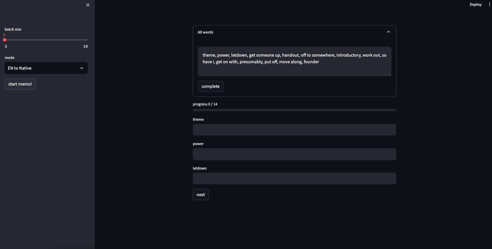
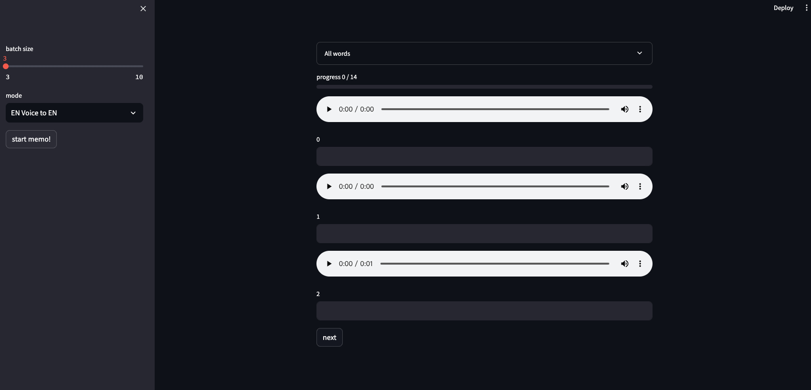
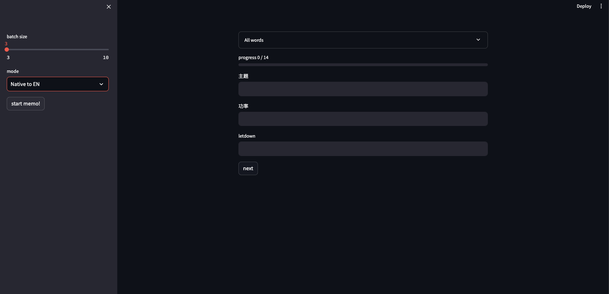
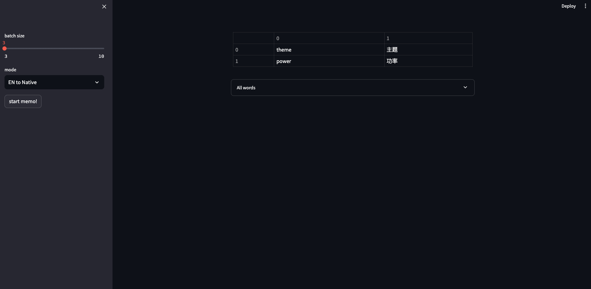

# Memo Word GPT

Memo Word GPT is a program built on Streamlit that assists in memorizing words. Simply input a list of English words and you can start memorizing.

## Memory Modes

1. **English Prompt, Chinese Translation**: In this mode, you will be prompted with an English word and you need to provide the corresponding Chinese translation.

2. **English Pronunciation, English Word**: In this mode, you will hear the pronunciation of an English word and you need to provide the correct English word.

3. **Chinese Prompt, English Word**: In this mode, you will be prompted with a Chinese word and you need to provide the correct English word.

## Demo Screenshots

Here are some demo screenshots of Memo Word GPT in action:


*Caption for English Prompt, Chinese Translation*


*Caption for English Pronunciation, English Word*


*Caption for Chinese Prompt, English Word*


*Caption for Result Sheet*

## Try It!

[Streamlit Community Cloud](https://memo-word-gpt.streamlit.app/)

## Features

- Automatic scoring and correction using GPT-powered algorithms.
- Memory assistant capabilities are currently under development.

## Getting Started

1. Install the dependencies by running the following command:
   ````
   pip install -r requirements.txt
   ```

2. Start using the program by running the following command:
   ````
   streamlit run ui.py
   ```

Make sure you have installed all the necessary dependencies before running the program.

## Contributions

Contributions are welcome! If you would like to contribute to Memo Word GPT, please follow these steps:

1. Fork the repository.
2. Create a new branch for your feature or bug fix.
3. Make your changes and commit them.
4. Submit a pull request.

Please ensure your code follows the coding conventions and includes relevant tests.

## License

This project is licensed under the [MIT License](LICENSE).

## Acknowledgements

A big thank you to the developers and contributors of the libraries and resources used in this project. Your work is greatly appreciated.